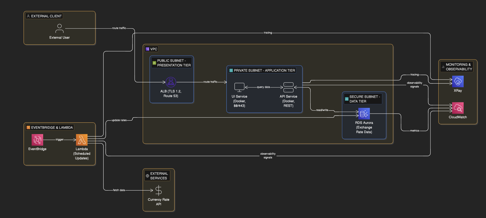
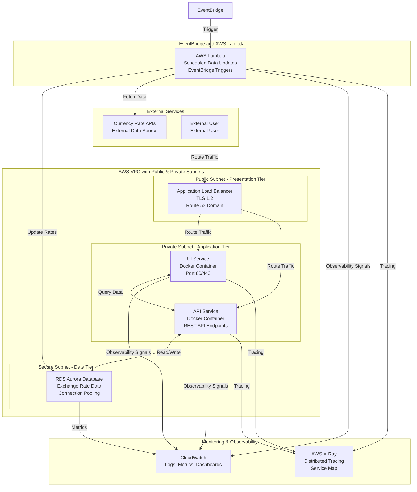

#  Currency Exchange Rate Platform Architecture

 mermaid source code's diagram 

```mermaid
graph TB
    subgraph VPC["AWS VPC with Public & Private Subnets"]
        subgraph PublicSubnet["Public Subnet - Presentation Tier"]
            ALB["Application Load Balancer<br/>TLS 1.2<br/>Route 53 Domain"]
        end
        
        subgraph PrivateSubnet["Private Subnet - Application Tier"]
            UI["UI Service<br/>Docker Container<br/>Port 80/443"]
            API["API Service<br/>Docker Container<br/>REST API Endpoints"]
        end
        
        subgraph SecureSubnet["Secure Subnet - Data Tier"]
            RDS["RDS Aurora Database<br/>Exchange Rate Data<br/>Connection Pooling"]
        end
    end
    
    subgraph Compute["EventBridge and AWS Lambda"]
        Lambda["AWS Lambda<br/>Scheduled Data Updates<br/>EventBridge Triggers"]
    end
    
    subgraph External["External Services"]
        CurrencyAPI["Currency Rate APIs<br/>External Data Source"]
    end

    subgraph External["External Client"]
        ExternalUser["External User<br/>External User"]
    end
    
    subgraph Observability["Monitoring & Observability"]
        CloudWatch["CloudWatch<br/>Logs, Metrics, Dashboards"]
        XRay["AWS X-Ray<br/>Distributed Tracing<br/>Service Map"]
    end
    
    ExternalUser -->|Route Traffic| ALB
    ALB -->|Route Traffic| UI
    ALB -->|Route Traffic| API
    UI <-->|Query Data| API
    API <-->|Read/Write| RDS
    Lambda -->|Update Rates| RDS
    EventBridge -->|Trigger| Lambda
    Lambda <-->|Fetch Data| CurrencyAPI
    UI -->|Observability Signals| CloudWatch
    API -->|Observability Signals| CloudWatch
    Lambda -->|Observability Signals| CloudWatch
    RDS -->|Metrics| CloudWatch
    UI -->|Tracing| XRay
    API -->|Tracing| XRay
    Lambda -->|Tracing| XRay
```

